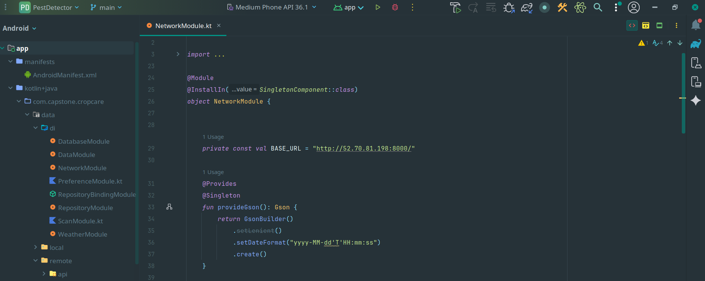

# Proyecto cropcare

|  |  |
| --- | --- |
| Django Rest Framework | Kotlin |


###### Explicación del proyecto

CropCare es una solución móvil y backend destinada a la detección temprana de plagas agrícolas mediante modelos de deep learning. La aplicación permite capturar una imagen del cultivo, analizarla y generar un reporte automático que queda almacenado para futuras visualizaciones y dashboards.

El proyecto sigue principios de Clean Architecture en el backend (Django REST Framework), asegurando modularidad y escalabilidad. En la app móvil se aplica el patrón MVVM, permitiendo una separación clara entre lógica y UI. La infraestructura opera bajo una arquitectura cloud en AWS, utilizando servicios como EC2, S3 y RDS.


##### Procesos para iniciar la aplicación


```
# Iniciación de entorno
python3 -m venv venv
pip install -r requirements.txt 

python manage.py makemigrations
python manage.py migrate

# sugerencia 
python manage.py runserver 0.0.0.0:8000
```

##### Estructura de archivo .env

```
# ============================
# ENVIRONMENT
# ============================
ENV=production
DEBUG=
SECRET_KEY=abcd1234

ALLOWED_HOSTS=*

# ============================
# DATABASE → RDS
# ============================
DB_NAME=
DB_USER=
DB_PASSWORD=
DB_HOST=database-
DB_PORT=5432

# ============================
# AWS S3
# ============================
AWS_ACCESS_KEY_ID=
AWS_SECRET_ACCESS_KEY=
AWS_STORAGE_BUCKET_NAME=
AWS_REGION=
AWS_S3_REGION_NAME=
```

###### Proceso de conexión para endpoints 

se debe cambiar el base url por una url estática creada por una instancia (en el ejemplo se observa que se uso una dirección EC2 de IP elásticas)

 
